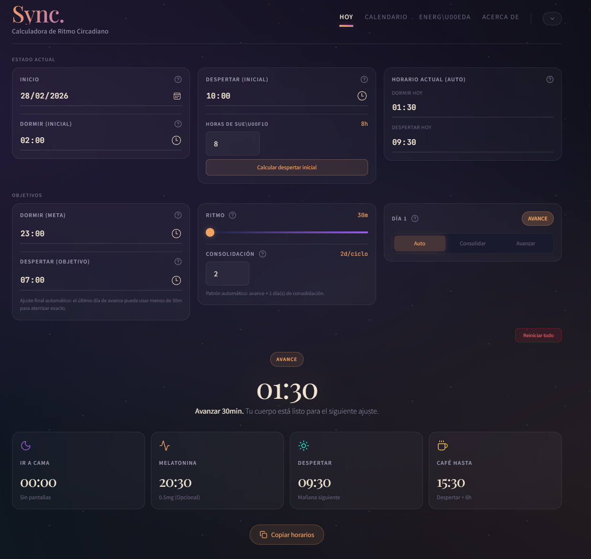

**Idioma: Português | [English](README.md) | [Español](README.es.md) | [中文](README.zh.md)**

# Sleep Sync

Um aplicativo de desktop que ajuda você a corrigir gradualmente seu horário de sono usando técnicas de avanço de fase circadiana.



## O Problema

Se você naturalmente adormece às 3 da manhã e acorda ao meio-dia, você não está quebrado. Você tem um cronotipo tardio -- uma variação biológica em que seu relógio interno funciona defasado em relação aos horários convencionais. Milhões de pessoas lidam com isso: desenvolvedores que programam melhor às 2 da manhã, gamers que encontram seu fluxo quando todo mundo já está dormindo, trabalhadores de turnos alternando entre rotações diurnas e noturnas, ou qualquer pessoa com Síndrome do Atraso de Fase do Sono (SAFS).

O conselho habitual -- "apenas vá dormir mais cedo" -- falha cerca de 80% das vezes porque seu ritmo circadiano resiste a mudanças abruptas. É como se forçar a viver em um jet lag permanente.

## A Ciência

Seu ritmo circadiano é regulado pelo núcleo supraquiasmático, um aglomerado de neurônios que responde à luz, temperatura, horário das refeições e melatonina. Tentar deslocar seu sono em 3 horas da noite para o dia luta contra todos esses sinais de uma vez.

O **avanço de fase** funciona de forma diferente: em vez de uma única mudança grande, você move seu horário para mais cedo em 30-60 minutos a cada poucos dias, alternando com dias de consolidação em que você mantém o horário estável. Isso dá ao seu relógio interno tempo para se recalibrar sem o estresse do jet lag social. Estudos clínicos mostram que o avanço de fase gradual tem taxas de sucesso acima de 80%, comparado a menos de 20% para mudanças abruptas.

## Como Funciona

O Sleep Sync implementa isso como um plano diário:

1. Você define seus horários atuais de sono/despertar e seu horário desejado.
2. Nos **dias de avanço**, o app antecipa seu horário de dormir em uma quantidade configurável (30-50 min).
3. Nos **dias de manutenção**, você mantém o horário atual para permitir que seu corpo se consolide.
4. O app rastreia **9 fases de energia** ao longo do dia em relação ao seu horário de despertar (inércia do sono, pico matinal, queda pós-almoço, desaceleração, etc.) para que você saiba o que esperar do seu corpo a cada hora.

Você pode forçar qualquer data específica para ser um dia de manutenção ou avanço, e confirmar conclusões de avanço com verificações integradas.

## Para Quem É

- **Desenvolvedores e notívagos** -- mude sua janela de foco profundo para um horário mais funcional sem perdê-la
- **Gamers e streamers** -- alinhe seu pico de desempenho com seu horário de transmissão
- **Pessoas com SAFS** -- uma abordagem estruturada e sem medicamentos para mover sua janela de sono
- **Trabalhadores de turnos** -- reduza a disrupção circadiana ao alternar entre turnos diurnos e noturnos

## Stack Tecnológico

| Camada   | Tecnologia                                              |
|----------|---------------------------------------------------------|
| Frontend | React 19, Vite 7, Tailwind CSS 4, Lucide React         |
| Backend  | Express 5, better-sqlite3 (modo WAL)                   |
| Auth     | Google OAuth 2.0 (react-oauth/google + google-auth-library), JWT |
| i18n     | i18next, react-i18next, detecção de idioma do navegador |
| Desktop  | Electron 33, electron-builder (instalador NSIS)         |
| Testes   | Test runner nativo do Node.js (node:test), 72 testes    |

## Primeiros Passos

### Pré-requisitos

- **Node.js 20+** (usa a flag `--env-file`; 24+ recomendado)
- Um **Google OAuth Client ID** do [Google Cloud Console](https://console.cloud.google.com/)

### Configuração do Google OAuth

1. Acesse Google Cloud Console > APIs & Services > Credentials.
2. Crie um **OAuth 2.0 Client ID** (tipo Web application).
3. Em **Authorized JavaScript origins**, adicione `http://localhost:5173`.
4. Copie o Client ID para o próximo passo.

### Instalação

```bash
git clone https://github.com/aqsashlux/sleep-sync.git
cd sleep-sync
npm install
```

Crie um arquivo `.env` na raiz do projeto com seus valores:

```env
GOOGLE_CLIENT_ID=your-client-id.apps.googleusercontent.com
VITE_GOOGLE_CLIENT_ID=your-client-id.apps.googleusercontent.com  # mesmo valor
JWT_SECRET=any-long-random-string
PORT=3001  # opcional, padrão é 3001
```

### Executando

Abra dois terminais:

```bash
# Terminal 1 -- Backend (porta 3001)
node --env-file=.env server.js

# Terminal 2 -- Frontend (porta 5173)
npm run dev
```

Abra [http://localhost:5173](http://localhost:5173) e faça login com sua conta Google, ou clique em **Experimentar sem conta** para usar o modo visitante (dados armazenados apenas localmente).

## Comandos

| Comando                           | Descrição                            |
|-----------------------------------|--------------------------------------|
| `npm run dev`                     | Iniciar servidor de desenvolvimento Vite |
| `node --env-file=.env server.js`  | Iniciar backend Express             |
| `npm run build`                   | Build de produção                    |
| `npm run electron:build:win`      | Build do app Windows (NSIS)          |
| `npm run lint`                    | Executar ESLint                      |
| `node --test tests/*.test.js`    | Executar todos os 72 testes          |
| `node db/migrate.js`             | Migrar db.json legado para SQLite    |

## Estrutura do Projeto

```
sleep-sync/
├── server.js              # Orquestrador Express (~35 linhas)
├── config.js              # Configuração centralizada (portas, caminho do DB, JWT, OAuth)
├── .env.example           # Template de variáveis de ambiente
├── db/
│   ├── schema.sql         # DDL do SQLite (4 tabelas)
│   ├── database.js        # Inicialização do SQLite + singleton getDB()
│   └── migrate.js         # Migração db.json -> SQLite
├── middleware/
│   └── auth.js            # requireAuth + optionalAuth (verificação JWT)
├── routes/
│   ├── auth.js            # Troca de token Google OAuth, endpoints de sessão
│   └── data.js            # CRUD de dados de sono com sanitização completa
├── services/
│   ├── user-service.js    # CRUD de usuários (findOrCreateUserByGoogle)
│   └── sleep-service.js   # Configurações de sono, overrides, verificações de avanço
├── src/
│   ├── main.jsx           # Entrada do app (provedores OAuth + Auth)
│   ├── App.jsx            # HashRouter, rotas protegidas/públicas
│   ├── i18n/
│   │   ├── index.js       # Configuração i18next (detecção, fallback)
│   │   └── locales/       # JSONs de tradução en, es, pt, zh
│   ├── context/
│   │   └── AuthContext.jsx # Auth Google + modo visitante
│   ├── hooks/
│   │   └── useAuth.js
│   ├── lib/
│   │   └── api.js         # Cliente HTTP com Bearer token, auto-logout em 401
│   └── components/
│       ├── CircadianCalculator.jsx   # Lógica principal e UI do app
│       ├── LoginScreen.jsx           # Google Sign-In + entrada de visitante
│       ├── UserMenu.jsx             # Avatar do usuário + dropdown de logout
│       ├── LanguageSwitcher.jsx     # Seletor de idioma (EN/ES/PT/ZH)
│       └── GuestBanner.jsx          # Banner informativo para modo visitante
├── electron/
│   ├── main.cjs           # Processo principal do Electron (popup OAuth, fork do servidor)
│   └── preload.cjs        # contextBridge
└── tests/                 # 72 testes usando node:test (SQLite em memória)
```

## API

Todos os endpoints de dados requerem um JWT no header `Authorization: Bearer <token>`.

| Método | Endpoint            | Auth | Descrição                                      |
|--------|---------------------|------|-------------------------------------------------|
| POST   | `/api/auth/google`  | Não  | Trocar token de ID do Google por um JWT         |
| GET    | `/api/auth/me`      | Sim  | Obter o perfil do usuário autenticado           |
| POST   | `/api/auth/logout`  | Sim  | Logout (stateless, remoção do token no cliente) |
| GET    | `/api/data`         | Sim  | Obter configurações e overrides de sono do usuário |
| POST   | `/api/data`         | Sim  | Salvar dados de sono (verificação de conflito baseada em revisão) |

### Modelo de dados

O banco de dados SQLite (`db/sync.db`) possui 4 tabelas:

- **users** -- Informações da conta Google (id, email, nome de exibição, avatar)
- **sleep_settings** -- 1:1 por usuário (horários de sono/despertar, quantidade de avanço, dias de consolidação, contador de revisão)
- **day_overrides** -- Overrides por data forçando manutenção ou avanço
- **advance_checks** -- Flags de confirmação de avanço por data

## Compilando o App Desktop

O build do Electron produz um instalador Windows (NSIS):

```bash
npm run electron:build:win
```

O instalador é gerado no diretório `release/`. No modo de produção, o Electron faz fork do servidor Express como processo filho e gerencia seu ciclo de vida.

## Funcionalidades

- Correção gradual do horário de sono via algoritmo de avanço de fase
- 9 fases de energia mapeadas ao seu horário de despertar
- Overrides por dia (forçar manutenção ou avanço em qualquer data)
- Verificações de confirmação de avanço
- **Interface multilíngue** -- Inglês (padrão), Espanhol, Português, Chinês Simplificado, com detecção automática do idioma do navegador
- **Modo visitante/demo** -- experimente o app sem criar conta; dados armazenados no localStorage
- **Suporte multiusuário** -- Google Sign-In com isolamento de dados por usuário no SQLite
- Prevenção de conflitos baseada em revisão em salvamentos simultâneos
- Tema escuro/noturno na interface
- App desktop com instalador para Windows

## Licença

[MIT](LICENSE)
